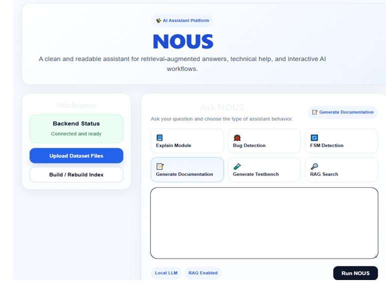
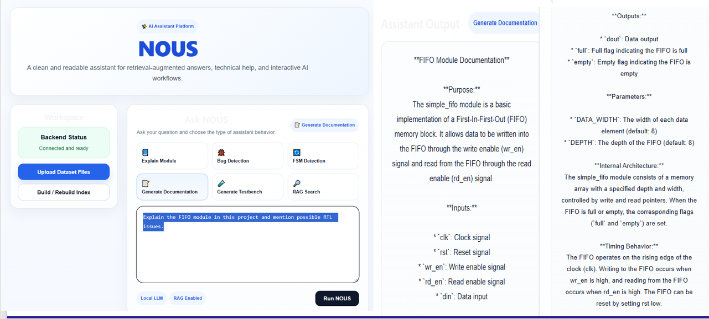
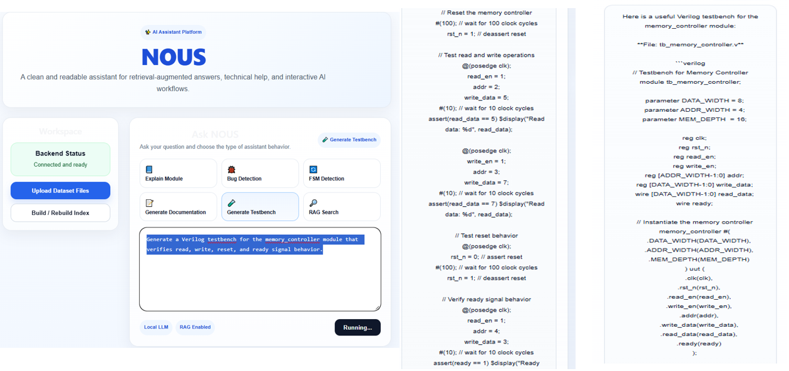
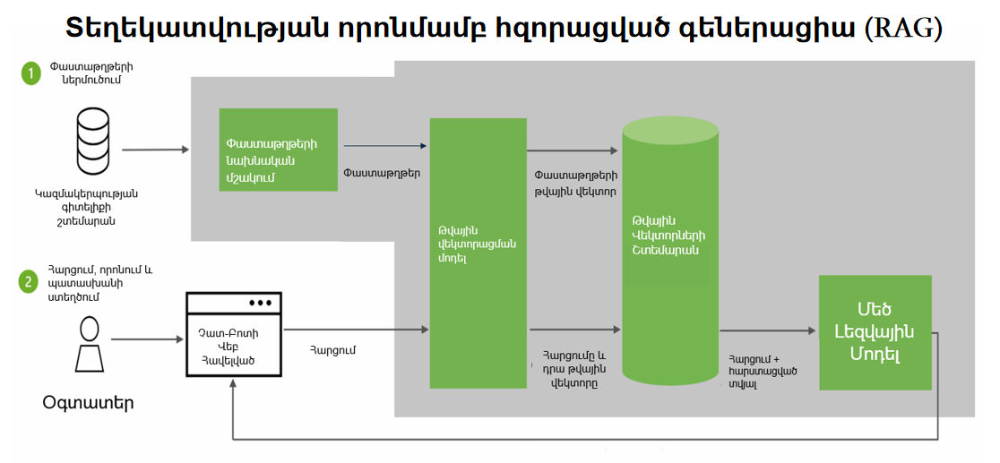
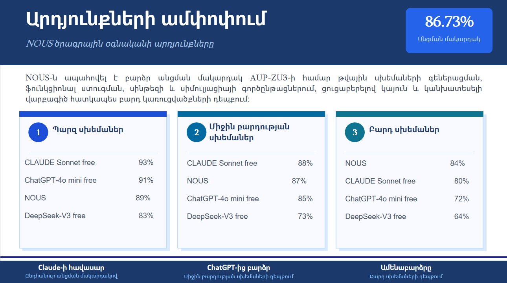
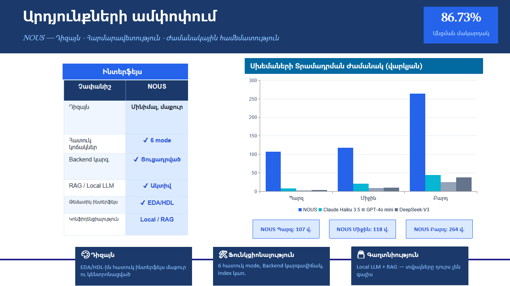

# 🤖 NOUS – IC Design Assistant

🎓 Bachelor Thesis Project

AI-powered assistant for digital integrated circuit design, verification, and SystemVerilog generation on the **AUP-ZU3 FPGA platform**.

---

## Overview

NOUS is a Retrieval-Augmented Generation (RAG) based AI assistant developed specifically for digital integrated circuit design on the **AUP-ZU3 FPGA platform**.

Unlike general-purpose AI assistants, NOUS utilizes a domain-specific Verilog/SystemVerilog dataset, platform-oriented validation procedures, and a retrieval-enhanced workflow designed for hardware design generation, verification, documentation, and debugging tasks.

The system combines a local Large Language Model (Llama 3), FastAPI backend, React frontend, and a specialized hardware design knowledge base to assist engineers and students throughout the digital design flow.

NOUS was developed and evaluated using designs targeting the AUP-ZU3 platform, and the reported performance metrics are specific to this environment.

---

## Key Features

✅ Verilog/SystemVerilog Code Generation

✅ Testbench Generation

✅ Bug Detection and Analysis

✅ FSM Detection and Analysis

✅ Hardware Design Documentation

✅ Retrieval-Augmented Generation (RAG)

✅ Local LLM Execution using Llama 3

✅ Interactive Web Interface

✅ AUP-ZU3 Platform Support

---

## System Architecture

```text
User
 │
 ▼
React Frontend
 │
 ▼
FastAPI Backend
 │
 ▼
RAG Retrieval Engine
 │
 ├── Verilog Dataset
 ├── Testbench Dataset
 │
 ▼
Llama 3 (Ollama)
 │
 ▼
Generated Response
```

---

## Technology Stack

| Component            | Technology                    |
| -------------------- | ----------------------------- |
| Frontend             | React + Vite                  |
| Backend              | FastAPI                       |
| AI Model             | Llama 3                       |
| Inference Engine     | Ollama                        |
| Programming Language | Python                        |
| Retrieval System     | RAG                           |
| Dataset              | Verilog/SystemVerilog Designs |

---

## Dataset

The assistant utilizes a specialized hardware design dataset containing:

* Logic Gates
* Encoders / Decoders
* Multiplexers / Demultiplexers
* Counters
* Code Converters
* Memory Modules
* FIFO / LIFO Structures
* Cache Systems
* SRAM / DRAM
* UART
* SPI
* I2C
* PCIe
* CAN
* AXI4-Lite
* Memory Controllers

### Dataset Statistics

| Metric                 | Value   |
| ---------------------- | ------- |
| Verilog Modules        | 53      |
| Testbenches            | 53      |
| Total Design Files     | 106     |
| Indexed Chunks         | 105     |
| Generated Descriptions | 16,000+ |

---

## Performance Results

The reported results are specific to the **AUP-ZU3 FPGA platform**, for which the dataset, validation process, synthesis flow, and verification procedures were specifically developed and optimized.

The assistant was evaluated using digital hardware design tasks, including:

* SystemVerilog code generation
* Testbench generation
* Functional verification
* Synthesis compatibility
* Simulation validation
* Documentation generation

### Overall Results

| Category                  | Pass Rate  |
| ------------------------- | ---------- |
| Simple Designs            | 89%        |
| Medium Complexity Designs | 87%        |
| Complex Designs           | 84%        |
| Overall Average           | **86.73%** |

### Comparative Evaluation

The comparison was conducted exclusively against **publicly available and free-access language models**.

| Assistant              | Overall Performance |
| ---------------------- | ------------------- |
| Claude Sonnet (Free)   | 88%                 |
| **NOUS**               | **86.73%**          |
| ChatGPT-4o mini (Free) | 85%                 |
| DeepSeek-V3 (Free)     | 73%                 |

For complex digital hardware designs, NOUS achieved the highest performance among the evaluated free-access systems due to its domain-specific optimization, specialized dataset, and validation workflow tailored for the AUP-ZU3 platform.

### Important Note

The reported results should not be interpreted as a universal comparison against all commercial or proprietary language models.

The evaluation focuses specifically on:

* Free-access AI assistants
* Digital hardware design tasks
* SystemVerilog generation and verification
* The AUP-ZU3 FPGA platform

As a result, the measured performance reflects the effectiveness of a specialized domain-oriented assistant rather than a general-purpose AI system.

---

## Screenshots

### Main Interface



### Documentation Generation



### Testbench Generation



### RAG Architecture



### Results Summary





---

## Installation

### Clone Repository

```bash
git clone https://github.com/AGrigoryan004/NOUS-IC-Design-Assistant.git
cd NOUS-IC-Design-Assistant
```

### Create Virtual Environment

```bash
python -m venv venv
venv\Scripts\activate
```

### Install Dependencies

```bash
pip install -r requirements.txt
```

### Start Backend

```bash
cd backend
uvicorn server:app --reload
```

### Start Frontend

```bash
cd frontend/nous-frontend
npm install
npm run dev
```

### Start Llama 3

```bash
ollama run llama3
```

---

## Thesis Presentation

📄 Project presentation is included in:

**NOUS.pdf**

---

## Project Structure

```text
NOUS-IC-Design-Assistant/
│
├── backend/
├── frontend/
├── dataset/
├── NOUS.pdf
├── requirements.txt
├── run_app.bat
└── README.md
```

---

## Author

**Artashes Grigoryan**

National Polytechnic University of Armenia

Bachelor Thesis Project

---

## Supervisor

**Vache Davtyan**

National Polytechnic University of Armenia
